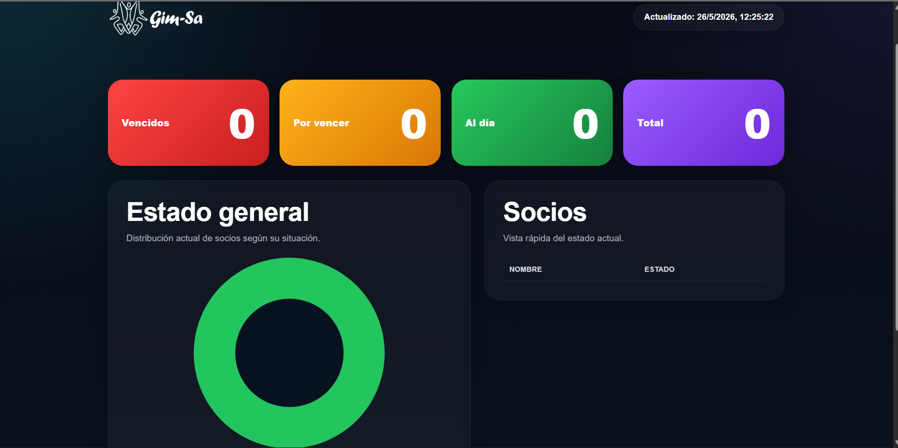

# Gym Membership Dashboard

Automated membership management system with dashboards, status tracking, Google Sheets synchronization and n8n workflows.

---

## Overview

This system was created to automate gym membership management and replace manual tracking processes.

The platform automates:

- Membership expiration tracking
- Automatic member status updates
- Dashboard metrics visualization
- Google Sheets synchronization
- Daily workflow automation
- Real-time reporting

---

## Features

- Automated membership reminders
- Real-time synchronization
- Dashboard analytics
- Google Sheets integration
- n8n automation workflows
- Status management system
- KPI visualization

---

## Tech Stack

- n8n
- Google Sheets
- JavaScript
- REST APIs
- Dashboard UI
- Automation workflows

---

## Architecture

Google Sheets → n8n Automation → Dashboard System → Status Updates

The workflow automatically updates member statuses based on expiration dates and synchronizes dashboard metrics.

---
## Screenshots

### Dashboard Overview

